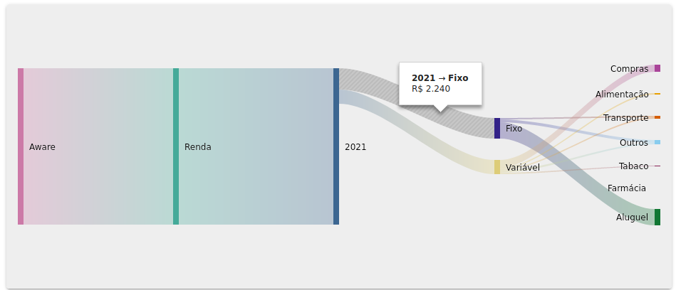
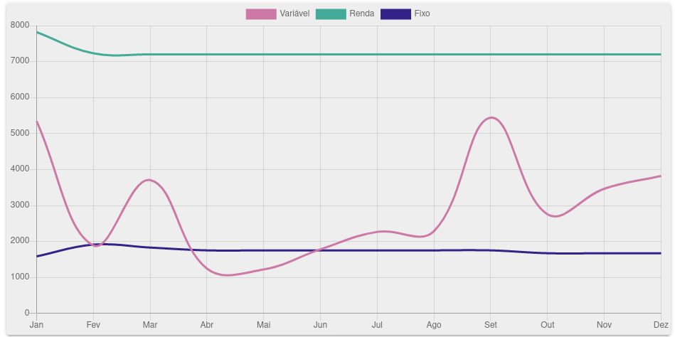
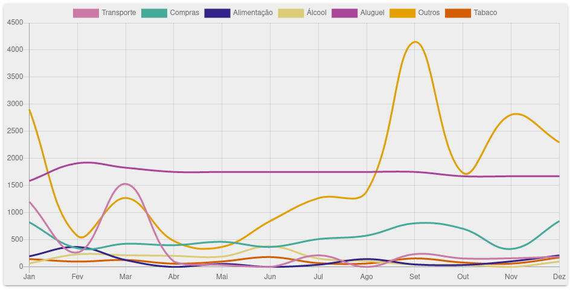

# Personal expenses management

## Table of Contents

1.  [Introduction](#org237780f)
2.  [Architecture](#orgf2c1d5e)
3.  [Installing and running the project](#org6c7ab97)
4.  [How to use](#org66fd11b)
    1.  [Create new expense category](#org29d79ba)
    2.  [Create payment method](#org44fe68e)
    3.  [Register expense](#orge2d8052)
    4.  [Graphs](#orga4cda91)
5.  [Self-hosting](#org83d82ca)
6.  [Contribution](#org00127b2)
7.  [License](#orgcb6b472)

## Introduction

This project was made to personally help me manage my monthly expenses by being a system where daily expenses can be recorded and then later monitored to check where all the money is going.

Another side goal was to re-familiarize with Vue.js as a frontend framework.

Its features include ways to:

-   input daily expenses, with its categories and expense type (fixed, variable, investment, or income);
-   download all the expenses as .csv or .xlsx;
-   register recurring monthly expenses that are automatically save on the given day of the month;
-   visualize the yearly or monthly expenses with graphs;

A running instance of the project, together with [backend code](https://github.com/miguel-faggioni/gastos-back), can be found on <https://anotar.coisa.online/>.

## Architecture

    /
    ├── .nvmrc - contains the version of node to be used in the project
    ├── public - static assets of the project
    └── src - general source code
        ├── App.vue - base for the entire project
        ├── main.js - entry point for the project, where the plugins are imported and #app is mounted
        ├── registerServiceWorker.js - configuration for the service worker to allow the project to work as PWA
        ├── plugins - configurations and customizations
        │   ├── array.js - definition of a .shuffle function for Array
        │   ├── axios.js - interceptor to add a bearer token and preffix all urls with the API url
        │   ├── date.js - definition of .getMonthAbbreviation and .getDayOfWeekAbbreviation functions for Date
        │   ├── sentry.js - on production environment, add Sentry watched to report all uncaught expections
        │   └── vuetify.js - configure Vuetify theme colors
        ├── router
        │   └── index.js - definition of all routes and the corresponding component or view
        ├── store
        │   ├── index.js - consolidation of the other Vuex modules
        │   ├── auth.api.js - authentication endpoints
        │   ├── categoria.api.js - endpoints related to expense category
        │   ├── debito.api.js - endpoints related to recurrent month expenses
        │   ├── feedback.api.js - endpoint for anonymous feedback
        │   ├── gasto.api.js - expense endpoints
        │   └── pagamento.api.js - endpoints related to payment types
        ├── components
        │   ├── charts - specific charts used on Analysis.vue
        │   │   ├── LineChart.vue - line graph
        │   │   ├── PieChart.vue - pie and doughnut charts
        │   │   ├── SankeyChart.vue - sankey graph
        │   │   └── TableChart.vue - table
        │   ├── Analysis.vue - component with all the graphs
        │   ├── Configurations.vue - hub to access dialogs for editing registered category and payment types, downloading or removing all data
        │   ├── EditCategorias.vue - dialog for editing expense type
        │   ├── EditPagamentos.vue - dialog for editing payment type
        │   ├── InputDebitos.vue - creation of recurrent monthly expense
        │   ├── InputGastos.vue - creation of expense
        │   ├── ListDebitos.vue - table with all recurrent month expenses
        │   ├── ListGastos.vue - table with all expenses
        │   ├── Login.vue - login, duh
        │   ├── RegisterCategoria.vue - dialog for creating a new type of expense type
        │   ├── RegisterModoDePagamento.vue - dialog for creating a new payment type
        │   └── Register.vue - user registry
        └── views
            ├── About.vue - about the project
            ├── Feedback.vue - anonymous feedback
            ├── Home.vue - basically the core of the project
            └── Landing.vue - horrendous landing page

## Installing and running the project

After cloning the repository, install the needed packages with:

    yarn

Then to run the project locally run:

    yarn serve

This will make the system available on <http://localhost:8080/>.

However it will access the backend running for <https://anotar.coisa.online/>, to point it to another backend, \`axios.defaults.baseURL\` must be updated on \`src/plugins/axios.js\` to the desired backend url. The repository for the backend can be found on <https://github.com/miguel-faggioni/gastos-back>.

## How to use

### Create new expense category

### Create payment method

### Register expense

### Graphs

On the dropdown it is possible to select a specific year or month with which to create the graphs

1.  Sankey

    The sankey graph shows the flow of the cash for the given year or month, with the income coming in through the left, and the fixed, variable, and investments on the right.
    
    

2.  Line graphs

    There are two line graphs, one where the expenses are split by their type:
    
    
    
    And another where they are split by their category:
    
    

## Self-hosting

In order to build and deploy when self-hosting, some scripts on `package.json` must be updated:

-   `deploy`
    -   change `anotar.coisa.online` to the correct AWS S3 bucket
-   `postdeploy`
    -   change `EYSHIAOAERFMG` to the correct AWS CloudFront ID

Then to build and deploy the code, run:

    yarn build
    yarn deploy

## Contribution

Any type of contribution is welcome, however since this is a side-project, I kindly ask of you to be patient in case there is any delay to respond to any issue or pull-request opened.

## License

Licensed under [GNU Affero General Public License v3](https://tldrlegal.com/license/gnu-affero-general-public-license-v3-(agpl-3.0))

